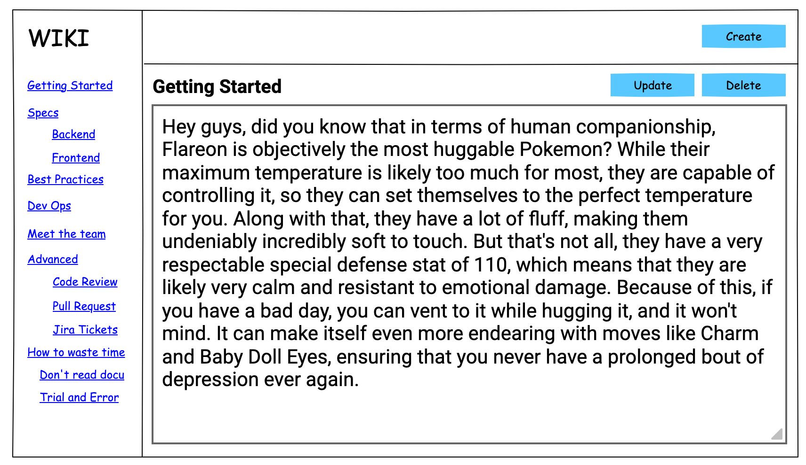
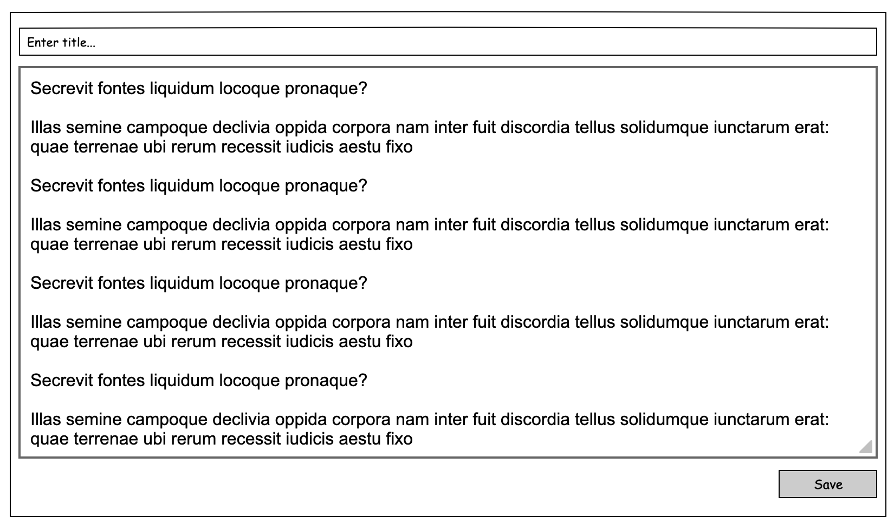
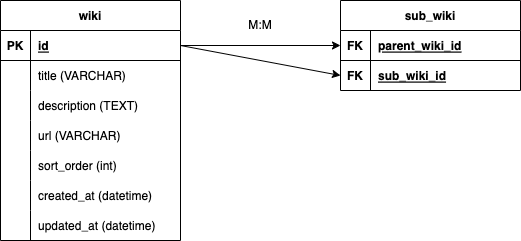

# Wiki Demo Project

A super basic wiki.

## Dependencies
* [PHP >= 8.1](https://www.php.net/)
* [npm](https://www.npmjs.com/)

## Getting started
1. `git clone {repo}`
2. Install vendors
```
composer install
npm install
```
3. Create db & populate data
```
php vendor/bin/doctrine orm:schema-tool:create
php vendor/bin/phinx seed:run 
```
4. Run php web server:
   `php -S localhost:8000 -t public`
5. Run client:
   `npm run serve`
6. Access http://localhost:9009

## Notes
### Database
This project uses sqlite for the database. The location can be found in `db/database.sqlite`

### Simple Overview (In Development)
A rough sketch for the **supposed** super basic wiki project. 
#### Index page

#### Create page

#### Super simple database schema 
Create a reference table for the parent and child relationship for sorting out Wiki positioning.



## TODO
- [ ] [react-router](https://reactrouter.com/en/main)
- [ ] Server wildcard routing/subdomain for dynamic Wiki urls
- [ ] Reorder of wiki/pages
- [ ] Edit content
- [ ] Parent and sub-wikis
- [ ] dotenv for configurations
- [ ] Utilize our bundler or use webpack 
- [ ] Pagination for GET requests
- [ ] Integrate Datatables
- [ ] \(Nice to Haves) [phpcs, phpbf, phpstan, grumphp]
- [ ] \(In the future) [PHPUnit, Jest]
